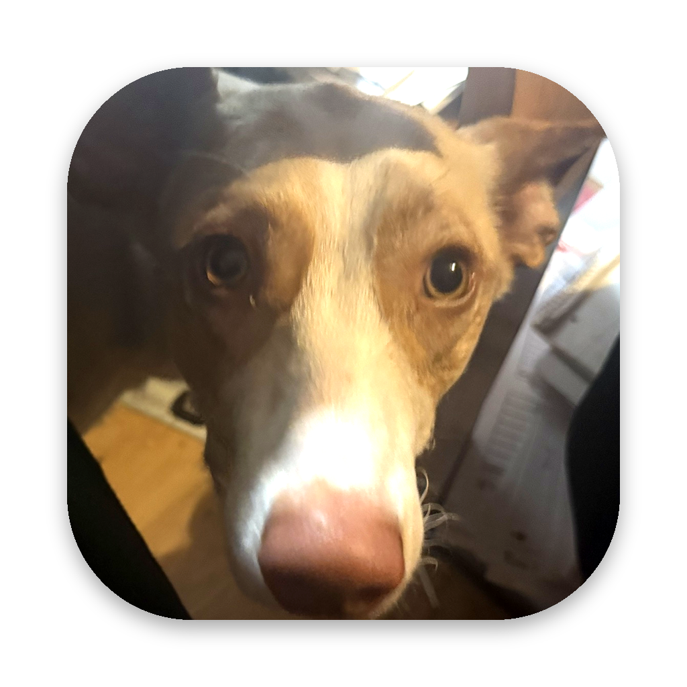

# Billy Desktop 🐾

Dein Hund **Billy** lebt als Desktop-Begleiter auf deinem Mac: Er läuft herum, sitzt, schläft, bellt,
lässt sich kraulen und herumtragen und **räumt auf Zuruf deinen Schreibtisch auf**. Er schnüffelt an
jeder Datei, trägt sie im Maul zum passenden Ordner und legt sie dort ab.

<p align="center"></p>

| Funktion | So geht's |
|---|---|
| Chat-Leiste „Frag Billy …“ | `⌃⌥B`, Doppelklick auf Billy oder Menüleiste 🐾 |
| Schreibtisch aufräumen | „Räum meinen Schreibtisch auf“ / „Can you clean my desktop“ |
| Rückgängig | „Rückgängig“ oder Menü → *Aufräumen rückgängig machen* |
| Kommandos | Sitz, Platz, Schlaf, Komm, Gassi, Gib Laut, Leckerli, Bleib, Spiel, Hilfe |
| Kraulen / Tragen | Billy anklicken bzw. mit der Maus ziehen |
| Echte Fotos statt Zeichnung | [docs/BILLY-FOTOS.md](docs/BILLY-FOTOS.md) |
| Freie Fragen (optional) | Menü → *Claude-Chat einrichten …* (Anthropic-API-Schlüssel) |

## Installation

1. **Ziel:** Billy als App auf deinem Mac starten.
2. **Voraussetzungen:** macOS 13 oder neuer, Xcode Command Line Tools (`xcode-select --install`), Git.
3. **Schritt für Schritt:**

   - Schritt 1: Repo klonen
     ```bash
     # Repository holen
     git clone https://github.com/arn0ld87/billy-desktop.git && cd billy-desktop
     ```
   - Schritt 2: App bauen und nach /Applications installieren
     ```bash
     # baut "build/Billy Desktop.app", kopiert sie nach /Applications und startet sie
     make install
     ```
   - Schritt 3: Rechte erteilen, wenn macOS fragt
     - *Schreibtisch-Zugriff* → **Erlauben** (zum Aufräumen)
     - *„Billy Desktop“ möchte „Finder“ steuern* → **OK** (damit Billy weiß, wo die Symbole liegen)
   - Schritt 4 (optional): Beim Anmelden automatisch starten → Menüleiste 🐾 → *Beim Anmelden starten*

4. **Überprüfung:**
   ```bash
   # App vorhanden und gültig signiert?
   codesign --verify --verbose=1 "/Applications/Billy Desktop.app"
   # erwartet: "... valid on disk" und "... satisfies its Designated Requirement"
   ```
   Billy erscheint unten rechts, sagt „Wuff! Ich bin Billy. 🐾“, und in der Menüleiste steht 🐾.

5. **Warum so?** Ein lokal gebautes, ad-hoc signiertes Bundle wird von Gatekeeper nicht blockiert. Die
   Swift-Package-Struktur baut ohne Xcode-Projekt und reproduzierbar. Aus der CI kannst du
   `Billy-Desktop.zip` als Artefakt laden; heruntergeladene Apps musst du aber einmal unter
   *Systemeinstellungen → Datenschutz & Sicherheit → Trotzdem öffnen* freigeben.

## Aufräumen – was genau passiert

| Kategorie → Ordner | Beispiele |
|---|---|
| Screenshots | `Bildschirmfoto …`, `Screenshot …`, `Bildschirmaufnahme …` |
| Bilder | jpg, png, heic, webp, psd, … |
| Dokumente | pdf, docx, pages, txt, md, xlsx, key, … |
| Musik / Videos | mp3, wav, m4a … / mov, mp4, mkv … |
| Archive / Installer | zip, 7z, tar.gz … / dmg, pkg, iso |
| Code | swift, py, js, ts, json, yaml, sh, … |
| Sonstiges | alles andere |

- Vor dem Start zeigt Billy eine Zusammenfassung und fragt nach Bestätigung.
- **Ordner, Apps und versteckte Dateien bleiben liegen.** Laufende Downloads (`.crdownload`, `.part`, …) auch.
- **Nichts wird überschrieben oder gelöscht.** Namenskonflikte werden wie im Finder aufgelöst (`Datei 2.pdf`).
- Die ersten 12 Dateien trägt Billy einzeln, den Rest im Schnelldurchgang.
- Rückgängig stellt den letzten Aufräumvorgang wieder her (`~/Library/Application Support/Billy Desktop/last-tidy.json`)
  und entfernt dabei nur leere Ordner, die Billy selbst angelegt hat.

## Claude-Chat (optional)

Ohne API-Schlüssel versteht Billy alle Kommandos oben, lokal und ohne Netz. Mit Schlüssel
(Menü → *Claude-Chat einrichten …*, gespeichert im macOS-Schlüsselbund) beantwortet er freie Fragen über die
Claude Messages API. Claude kann dabei höchstens eine Aktion aus einer festen Liste vorschlagen,
Aufräumen fragt trotzdem immer nach.

```bash
# anderes Modell verwenden (Standard: claude-opus-5)
defaults write de.arn0ld87.billy-desktop claudeModel claude-sonnet-5
```

## Entwicklung

```bash
swift build && swift test          # Kernlogik + Tests
swift run BillyDesktop             # direkt aus dem Repo starten
make sprites                       # gezeichnete Sprites neu rendern (Python)
make photos PHOTOS=~/Pictures/Billy-Fotos   # eigene Fotos importieren
```

| Pfad | Inhalt |
|---|---|
| `Sources/BillyCore` | reine Logik: Befehlserkennung, Kategorien, Aufräumplan, Ausführung + Undo |
| `Sources/BillyDesktop` | AppKit/SwiftUI: Billy-Fenster, Animation, Chat, Finder-Anbindung, Menü |
| `Resources/Sprites` | gezeichnete Sprites (erzeugt von `tools/sprites/generate_sprites.py`) |
| `tools/photos/import_photos.py` | macht aus ChatGPT-Bildern Foto-Sprites |
| `tools/icon/make_icon.py` | App-Icon aus einem Foto |

## Nächste Schritte

1. Echte Billy-Fotos mit ChatGPT erzeugen und importieren → [docs/BILLY-FOTOS.md](docs/BILLY-FOTOS.md)
2. Optional einen Claude-Schlüssel hinterlegen, damit Billy frei plaudert
3. `make install` nach jedem `git pull` erneut ausführen
